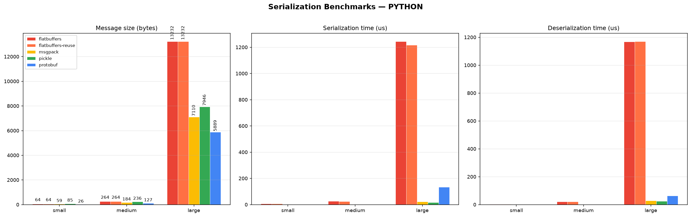
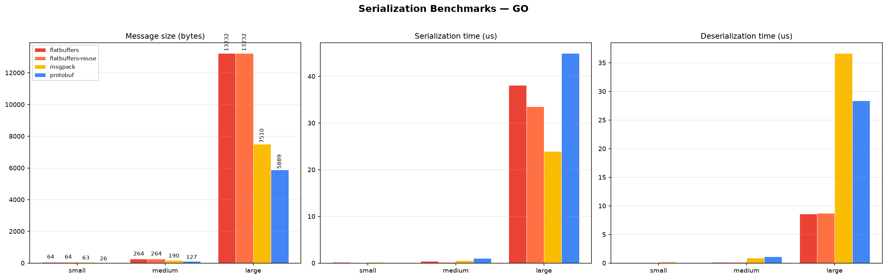

# serialization-protocols-benchmark

> ⚠️ **Disclaimer:** репозиторий преимущественно навайбкожен. Результаты проверены и выправлены вручную, но используйте на свой страх и риск.

Сравнение производительности протоколов сериализации для разнотипных Python-объектов.

**Основной язык — Python.** Реализация на Go добавлена для верификации: показать, что превосходство одного протокола над другим не является артефактом конкретного языка, а обусловлено свойствами самого протокола.

| Python        | Go            |
|---------------|---------------|
| **protobuf**  | **protobuf**  |
| **flatbuffers**| **flatbuffers**|
| **msgpack**   | **msgpack**   |
| **pickle**    | —             |

## Benchmark design

Три размера полезной нагрузки:

| Dataset | Описание |
|---------|----------|
| **small** | 4 примитивных поля (`int`, `float`, `str`, `bool`) |
| **medium** | Вложенные объекты, числовые массивы, строковые map'ы |
| **large** | Список из 100 комплексных объектов с вложенными массивами |

Измеряемые метрики:
- **Размер сообщения** (байты)
- **Время сериализации** (микросекунды на вызов, среднее за 10 000 / 2 000 итераций)
- **Время десериализации** (микросекунды на вызов, включая полный доступ ко всем полям)

Перед замерами — 200 итераций прогрева. Все протоколы оперируют семантически эквивалентными данными. В обоих языках GC отключён на время замерных циклов: `gc.disable()` в Python, `debug.SetGCPercent(-1)` в Go. Между ser- и deser-циклами — принудительный `gc.collect()`/`runtime.GC()`.

## Project structure

```
├── schemas/           # benchmark.proto  +  benchmark.fbs
├── python/
│   ├── benchmark.py   # Python-бенчмарк
│   ├── plot.py        # matplotlib-визуализация
│   └── generated/     # сгенерированный код protobuf/flatbuffers
├── go/
│   ├── main.go        # Go-бенчмарк
│   ├── go.mod
│   └── generated/     # сгенерированный код Go
├── results/           # *.json — результаты замеров
├── plots/             # *.png — графики
├── Makefile
└── pyproject.toml     # uv-зависимости Python
```

## Quick start

```bash
# Генерация кода (однократно, требуется protoc + flatc)
make generate

# Запуск бенчмарков и генерация графиков
make run               # python + go → results/*.json
make plot              # matplotlib → plots/*.png
make                   # всё вместе
```

Требования: `protoc`, `flatc`, `go` (≥1.21), `uv`, Python ≥3.10.

---

## Результаты — Python

| Protocol    | Dataset | Size (B) | Ser (µs) | Deser (µs) |
|-------------|---------|----------|----------|------------|
| protobuf    | small   | 26       | 0.51     | 0.43       |
| protobuf    | medium  | 127      | 2.30     | 1.91       |
| protobuf    | large   | 5 889    | 132.82   | 63.11      |
| flatbuffers | small   | 64       | 7.61     | 4.06       |
| flatbuffers | medium  | 264      | 26.44    | 21.53      |
| flatbuffers | large   | 13 232   | 1274.29  | 1174.69    |
| fb-reuse    | small   | 64       | 7.35     | 3.77       |
| fb-reuse    | medium  | 264      | 25.78    | 21.57      |
| fb-reuse    | large   | 13 232   | 1270.95  | 1167.11    |
| msgpack     | small   | 59       | 0.26     | 0.25       |
| msgpack     | medium  | 184      | 0.63     | 0.76       |
| msgpack     | large   | 7 110    | 23.40    | 27.59      |
| pickle      | small   | 85       | 0.45     | 0.36       |
| pickle      | medium  | 236      | 0.69     | 0.84       |
| pickle      | large   | 7 946    | 17.43    | 24.34      |



---

## Результаты — Go (верификация)

Go-реализация проверяет, что относительный порядок протоколов не зависит от языка. Ранжирование действительно сохраняется.

| Protocol    | Dataset | Size (B) | Ser (µs) | Deser (µs) |
|-------------|---------|----------|----------|------------|
| protobuf    | small   | 26       | 0.11     | 0.10       |
| protobuf    | medium  | 127      | 1.07     | 1.13       |
| protobuf    | large   | 5 889    | 44.96    | 28.39      |
| flatbuffers | small   | 64       | 0.19     | 0.02       |
| flatbuffers | medium  | 264      | 0.38     | 0.13       |
| flatbuffers | large   | 13 232   | 38.13    | 8.58       |
| fb-reuse    | small   | 64       | 0.06     | 0.01       |
| fb-reuse    | medium  | 264      | 0.22     | 0.14       |
| fb-reuse    | large   | 13 232   | 33.54    | 8.71       |
| msgpack     | small   | 63       | 0.18     | 0.22       |
| msgpack     | medium  | 190      | 0.51     | 0.91       |
| msgpack     | large   | 7 510    | 23.98    | 36.67      |



---

## Анализ

### Размер сообщения

- **protobuf** — самые компактные сообщения (26 B для small, ~5.9 KB для large), примерно вдвое меньше msgpack.
- **flatbuffers** — наибольший размер из-за vtable-ов и выравнивания (~2× protobuf).
- **msgpack** и **pickle** — посередине; msgpack стабильно компактнее pickle.

### Скорость сериализации

- **msgpack** — самый быстрый в Python (0.26–23 µs), за ним pickle.
- **flatbuffers** — существенно медленнее остальных в Python (8–1274 µs): построение буфера требует пошагового ручного bookkeeping'а offset'ов. Переиспользование билдера (`fb-reuse`) почти не даёт выигрыша в Python (аллокация дёшева относительно offset-арифметики), но даёт заметный прирост в Go (0.16→0.06 µs на small, 40.63→31.46 µs на large) — там аллокация буфера занимает ощутимую долю времени.
- **protobuf** — хороший баланс скорости и размера.

### Скорость десериализации

- **protobuf** — стабильно быстр благодаря оптимизированному C-коду парсинга.
- **msgpack** и **pickle** — полная реконструкция объектов, что для вложенных структур даёт сопоставимые с protobuf времена на small/medium.
- **flatbuffers** — в теории zero-copy, но Python-оверхед runtime'а сводит это преимущество на нет: десериализация оказывается самой медленной (до 1287 µs на large). В Go (где zero-copy работает напрямую) — 9 µs на том же наборе данных, что подтверждает: проблема именно в реализации Python-библиотеки, а не в протоколе.

### Верификация через Go

Реализация на Go подтверждает, что наблюдаемые в Python различия между протоколами — не артефакт языка:

- **protobuf** всегда даёт минимальный размер сообщения — свойство wire-формата.
- **flatbuffers** всегда занимает больше места — свойство vtable-архитектуры.
- **flatbuffers** всегда быстр в десериализации там, где zero-copy работает напрямую (Go), и медлен там, где эмулируется (Python) — это свойство реализации, а не протокола.
- **msgpack** всегда — хороший компромисс, независимо от языка.

### Рекомендации

| Сценарий                                   | Протокол |
|--------------------------------------------|----------|
| Минимальный размер сообщения               | **protobuf** |
| Максимальная скорость сериализации          | **msgpack** |
| Быстрая десериализация (read-heavy)         | **protobuf** |
| Schema-free, быстрое прототипирование       | **msgpack** |
| Акторный фреймворк (production)             | **protobuf** |
| Акторный фреймворк (прототип)               | **msgpack** |

### Для акторного фреймворка: msgpack vs protobuf

Выбор сводится к компромиссу между скоростью и эволюцией схемы.

| Критерий                         | msgpack                  | protobuf                       |
|----------------------------------|--------------------------|--------------------------------|
| Скорость ser/deser (Python)       | лучшая (0.26–23 µs)      | 2–3× медленнее (0.38–134 µs)  |
| Размер сообщения                 | средний                  | минимальный                    |
| Эволюция схемы                   | ручная                   | встроенная forward/backward    |
| Итерация / прототипирование       | быстро (без кодогенерации)| медленнее (перегенерация .proto)|
| Безопасность                     | нет code exec            | нет code exec                  |

**Рекомендация:**
- **msgpack** — прототипирование, короткоживущие системы, частый рефакторинг сообщений.
- **protobuf** — production, долгоживущие акторы, rolling-обновления, кросс-языковая совместимость.

Разница в latency для small/medium-сообщений (~0.1–1 µs) пренебрежима на фоне inbox/scheduling overhead'а акторного рантайма — схема и её эволюция на длинной дистанции перевешивают.

---

## License

MIT — see [LICENSE](LICENSE)
